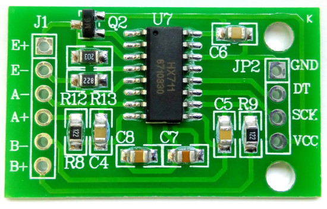

# BBC micro:bit MakeCode editor extension for HX711 connected to weight sensors

[HX711](https://www.mouser.com/datasheet/2/813/hx711_english-1022875.pdf) Based on Avia Semiconductor’s patented technology, HX711 is a precision 24-bit analogto-digital converter (ADC) designed for weigh scales and industrial control applications to interface directly with a bridge sensor. 

My codes are based on [Arduino sources - 2018 Bogdan Necula](https://github.com/bogde/HX711) Translated from Arduino C to Makecode.

To import this extension, go to Advanced -> +Extension and enter "HX711" in the search box, or copy/paste [https://github.com/daferdur/pxt-myHX711](https://github.com/daferdur/pxt-myHX711) into the search box. Press enter and click the extension.




## Synopsis

### Blocking mode
The library is usually used in blocking mode, i.e. it will wait for the
hardware becoming available before returning a reading.

// 1. HX711 circuit wiring
const int LOADCELL_DOUT_PIN = 2;
const int LOADCELL_SCK_PIN = 3;

// 2. Adjustment settings
const long LOADCELL_OFFSET = 50682624;
const long LOADCELL_DIVIDER = 5895655;

// 3. Initialize library
loadcell.begin(LOADCELL_DOUT_PIN, LOADCELL_SCK_PIN);
loadcell.set_scale(LOADCELL_DIVIDER);
loadcell.set_offset(LOADCELL_OFFSET);

// 4. Acquire reading
Serial.print("Weight: ");
Serial.println(loadcell.get_units(10), 2);

### Non-blocking mode
It is also possible to define a maximum timeout to wait for the hardware
to be initialized. This won't send the program into a spinlock when the
scale is disconnected and will probably also account for hardware failures.
```
// 4. Acquire reading without blocking
if (loadcell.wait_ready_timeout(1000)) {
    long reading = loadcell.get_units(10);
    Serial.print("Weight: ");
    Serial.println(reading, 2);
} else {
    Serial.println("HX711 not found.");
}
```

## Features
1. It provides a `tare()` function, which "resets" the scale to 0. Many other
   implementations calculate the tare weight when the ADC is initialized only.
   I needed a way to be able to set the tare weight at any time.
   **Use case**: Place an empty container on the scale, call `tare()` to reset
   the readings to 0, fill the container and get the weight of the content.

2. It provides a `power_down()` function, to put the ADC into a low power mode.
   According to the datasheet,
   > When PD_SCK pin changes from low to high and stays at high
   > for longer than 60μs, HX711 enters power down mode.

   **Use case**: Battery-powered scales. Accordingly, there is a `power_up()`
   function to get the chip out of the low power mode.

3. It has a `set_gain(byte gain)` function that allows you to set the gain factor
   and select the channel. According to the datasheet,
   > Channel A can be programmed with a gain of 128 or 64, corresponding to
   a full-scale differential input voltage of ±20mV or ±40mV respectively, when
   a 5V supply is connected to AVDD analog power supply pin. Channel B has
   a fixed gain of 32.

   The same function is used to select the channel A or channel B, by passing
   128 or 64 for channel A, or 32 for channel B as the parameter. The default
   value is 128, which means "channel A with a gain factor of 128", so one can
   simply call `set_gain()`.

   This function is also called from the initializer method `begin()`.

4. The `get_value()` and `get_units()` functions can receive an extra parameter "times",
   and they will return the average of multiple readings instead of a single reading.


## How to calibrate your load cell
1. Call `set_scale()` with no parameter.
2. Call `tare()` with no parameter.
3. Place a known weight on the scale and call `get_units(10)`.
4. Divide the result in step 3 to your known weight. You should
   get about the parameter you need to pass to `set_scale()`.
5. Adjust the parameter in step 4 until you get an accurate reading.


## Credits
Thanks to Weihong Guan who started the first version of this library in 2012
already (see [[arduino|module]Hx711 electronic scale kit](http://aguegu.net/?p=1327),
[sources](https://github.com/aguegu/ardulibs/tree/master/hx711)), Bogdan Necula
who took over in 2014 and last but not least all others who contributed to this
library over the course of the last years, see also `CONTRIBUTORS.rst` in this
repository.

#### See also
- https://item.taobao.com/item.htm?id=18121631630
- https://item.taobao.com/item.htm?id=544769386300


## Blocks

The extension can be used for HX711 modules. Use the first block to select module type and read data.


```blocks
basic.forever(function () {
    DHT11_DHT22.queryData(
    DHTtype.DHT11,
    DigitalPin.P0,
    true,
    false,
    true
    )
    basic.showString("T: " + DHT11_DHT22.readData(dataType.temperature) + " *C")
})
```


## Sensor wiring

There are two types of DHT11/DHT22s, one without PCB boards and have 4 pins; another have PCB boards, built-in pull up resistors and only 3 pins. Personally I would recommend you to use PCB versions.

For the PCB version it's easy: Vcc (+) to 3.3V or 5V (both works), GND (-) to GND, Data (out) to any GPIO pins you like.


Be noted that some PCB version sensors may have different order of pins.

If you are using the 4-pin version, you'll need to add a resistor (in my test 220 Ω - 10 KΩ works under 3.3V; above that the sensor won't response) between Vcc and Data to pull up the voltage of the data pin. Or you can simply use the pull up option in the query block - the micro:bit has internal resistors about 12-13 KΩ.

The third pin on the 4-pin sensor from the left is not used.


If a hardware pull-up resistor already exists, use the internal pull up resistor dosen't seems to affect the results.

## License

MIT

## Supported targets

* for PXT/microbit
(The metadata above is needed for package search.)

